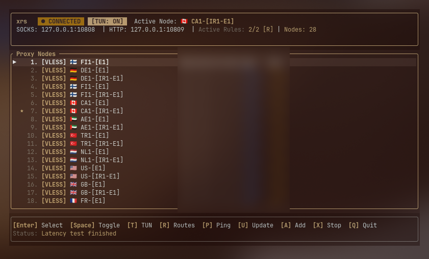

# xrs

**The featherweight Xray client. One binary, zero bloat, total control.**

[](https://github.com/mahdjalili/xrs/releases)
[](LICENSE)



xrs is a blazing-fast proxy client built on Xray-core. It lives in your terminal, sips memory, and gets out of your way: connect, switch servers, and manage routing without ever touching a heavy GUI app.

## Why xrs

| | xrs | Typical GUI clients |
|---|---|---|
| Binary size | **~2.4 MB** | 100–300 MB |
| Idle memory (TUI, 200 servers) | **~4.4 MB** | 200–350 MB |
| Connected memory (client + core) | **36 MB** | 133–387 MB |
| Idle CPU (TUI) | **~0.1%** | n/a |
| Status check (`xrs status`) | **~1.5 ms** | n/a |
| Dependencies | **None** (one binary, needs only glibc) | Qt / Electron runtimes |

<sub>xrs figures measured for v0.4.0 on x86_64 Linux with the stripped release build: memory is resident set size, idle CPU was sampled over 30 s, and status check time is the hyperfine mean of 500 runs. The TUI runs on a single thread and peaks at ~5.1 MB while latency-testing 200 servers. The connected-memory row is the client and its proxy core together; the breakdown is below.</sub>

### Connected memory, client plus core

The ~4.4 MB figure is the xrs TUI on its own. A connected session also runs Xray-core. The xrs column below was remeasured for v0.4.0 on Ubuntu 24.04 x86_64 against a local VLESS + WebSocket server; Throne, Hiddify, and v2rayN keep the earlier same-methodology numbers from that machine.

| | **xrs 0.4.0** | Throne 1.3.2 | Hiddify 4.1.1 | v2rayN 7.24.9 |
|---|---:|---:|---:|---:|
| Client | 4.5 MB | 69.2 MB | in-process | 316.2 MB |
| Proxy core | 31.7 MB | 64.1 MB | in-process | 70.6 MB |
| **Combined** | **36.2 MB** | 133.2 MB | 378.2 MB | 386.8 MB |

<sub>Resident set size after proxying 60 MB (three 20 MB downloads through the client's SOCKS port). RSS is summed from `/proc/<pid>/smaps_rollup` over the client and every process it spawned. Combined is that measured total. xrs is the v0.4.0 release binary with the TUI open, plus Xray-core 26.9.30 started by `xrs start` (32,448 KiB for the core, 4,632 KiB for the TUI, 37,080 KiB together). Idle, right after connect and before the download, the same pair sat at 35.9 MB. With the TUI closed, `xrs start` leaves only Xray-core, at 31.4 MB idle / 31.7 MB after the download. v2rayN 7.24.9 ran its bundled Xray 26.7.28 (72,248 KiB) beside the Avalonia UI (323,836 KiB). Throne 1.3.2 served the traffic with sing-box via ThroneCore (65,600 KiB) next to the Qt UI (70,840 KiB); that build also ships Xray-core 26.9.9. Hiddify 4.1.1 loads hiddify-core inside the app process (`hiddify-core.so`), so the UI and the core are a single 387,288 KiB RSS. Proportional set size for the remeasured xrs stack is 34.6 MB; the earlier comparison clients ranked 120.6 MB, 364.9 MB, and 369.2 MB.</sub>

## Features

- **⚡ Instant everything:** connect, switch nodes, and toggle the proxy in milliseconds, from the terminal or a single keypress.
- **🖥️ Beautiful terminal UI:** just run `xrs`. Tabs for servers, routing and subscriptions, a filterable and sortable server table with live real latency (through-proxy HTTP), a details pane, mouse support, and a `?` shortcut sheet. Nothing blocks: connecting, latency tests and subscription syncs run in the background. It picks up your terminal and desktop theme colors automatically.
- **🔒 Full-tunnel TUN mode:** route your entire system through the proxy at the network layer, not just apps that respect proxy settings. One-time setup, then a single `T` keypress.
- **🧭 Routing rules you control:** bypass lists, ad & malware blocking, and custom domain/IP rules. Ships with an Iran-routing preset (domestic traffic goes direct, zero proxy lag). Toggle any rule live, no restarts to configure.
- **🔗 Links & subscriptions:** paste a single `vless://`, `vmess://`, `trojan://` or `ss://` link, or plug in a subscription URL with auto-refresh.
- **🔄 Runs in the background:** optional systemd service keeps you connected across logins.
- **🧩 Bar widget:** an optional native top-bar dropdown with an on/off switch, one-click server switching, and quick actions.

## Install

Grab the tarball for your machine from the [latest release](https://github.com/mahdjalili/xrs/releases) (`linux-amd64` for most PCs, `linux-arm64` for ARM boards like Raspberry Pi):

```bash
tar xzf xrs-*-linux-amd64.tar.gz
install -Dm755 xrs-*-linux-amd64/xrs ~/.local/bin/xrs
xrs install-xray   # fetches the latest Xray engine + routing data (first run only)
xrs setup-tun      # one-time setup for TUN mode (asks for password once)
```

No root needed. Everything lives in your home directory.

## Quick start

```bash
xrs                          # open the interactive interface
xrs node add "vless://..."   # add a server from a share link
xrs sub add "https://..."    # ...or add a whole subscription
xrs node select              # pick a server (interactive list)
xrs toggle                   # connect / disconnect
xrs tun on                   # full-system tunnel mode
```

## For developers

```bash
cargo build --release      # optimized binary at target/release/xrs
cargo clippy               # lint gate: no unwrap(), no unsafe code
```

Tagged `v*` pushes build signed Linux tarballs (`amd64` + `arm64`) via GitHub Actions and publish them as releases. See [`.github/workflows/build.yml`](.github/workflows/build.yml).

## License

MIT, see [LICENSE](LICENSE).
